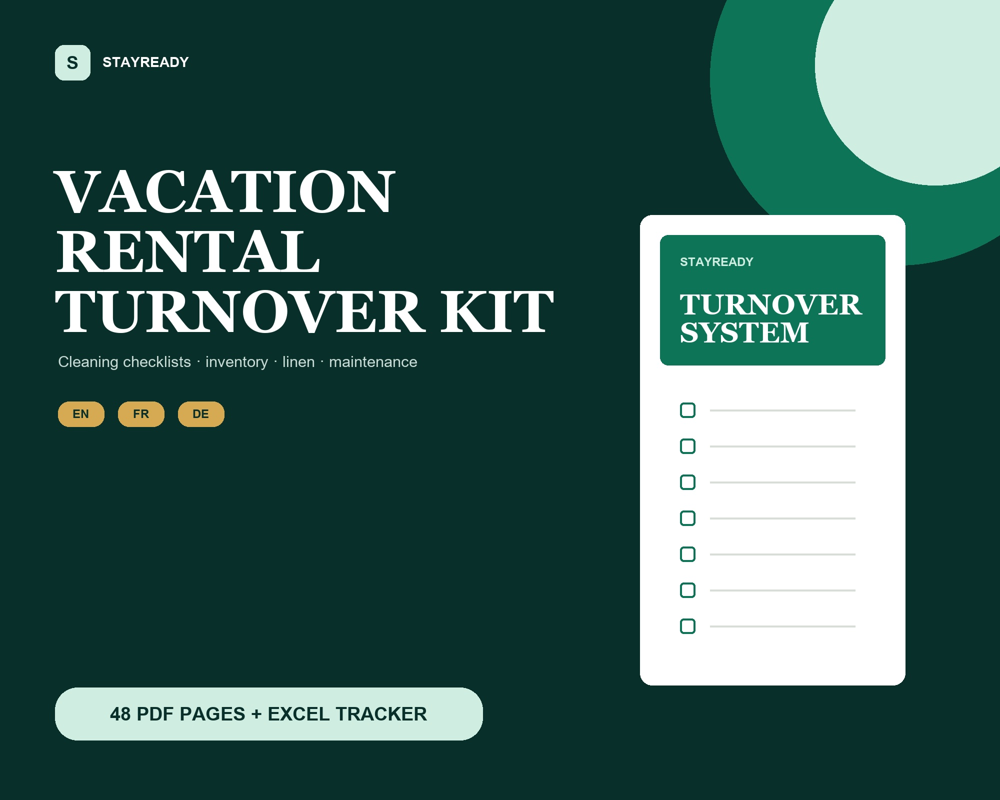

# StayReady — Kit numérique de rotation pour logements

StayReady transforme la préparation, le contrôle et la transmission d’un logement en procédure claire. Le kit est destiné aux propriétaires, conciergeries et petites équipes de location.

## Prix et livraison

- **CHF 14.90**, paiement unique, aucun abonnement.
- Produit numérique livré sous forme d’une archive ZIP après confirmation du paiement.
- Paiement prévu après validation du compte marchand : **TWINT immédiat** et, uniquement si Payrexx l’active pour ce compte CHF, **Pay by Bank / virement bancaire**.
- Aucune carte, aucun crédit, aucune facture après livraison et aucun paiement différé.
- Le paiement est actuellement désactivé pendant la vérification réglementaire Payrexx.

## Contenu du kit

- un guide de démarrage PDF ;
- trois guides opérationnels PDF en français, allemand et anglais ;
- un tableau de suivi XLSX ;
- cinq fichiers au total, réunis dans une archive ZIP.

## Vendeur et contact

**StayReady — Rexhep Kllokoqi**  
Entreprise individuelle exploitée par Rexhep Kllokoqi  
Chemin de la Colline 19  
1635 La Tour-de-Trême, Suisse  
E-mail : probe2.ka3@gmail.com  
Téléphone : +41 79 719 59 38

## Informations légales

- [Conditions générales de vente](CONDITIONS.md)
- [Politique de confidentialité](CONFIDENTIALITE.md)
- [Mentions légales](MENTIONS-LEGALES.md)

Le paiement marchand sera traité par Payrexx AG après validation du compte. Cette page est une présentation publique ; elle ne collecte aucune commande et ne contient aucune donnée bancaire du vendeur.
